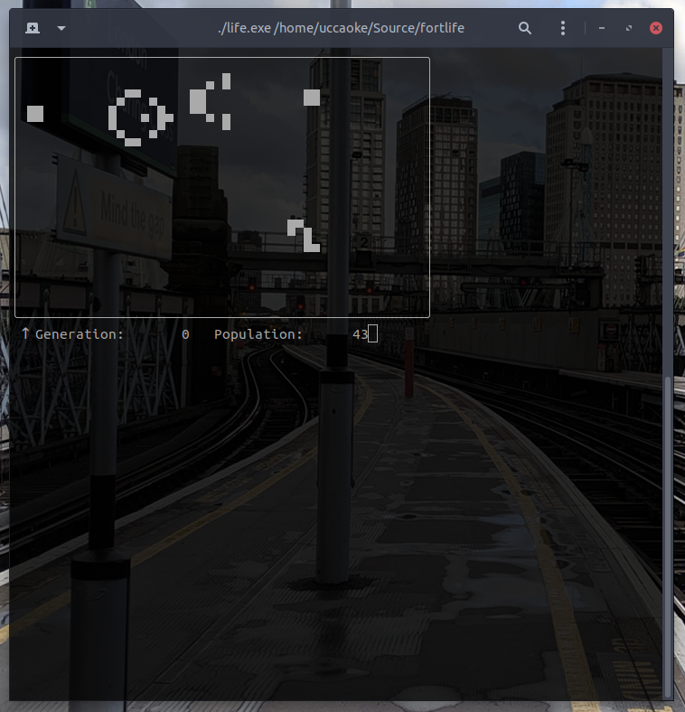
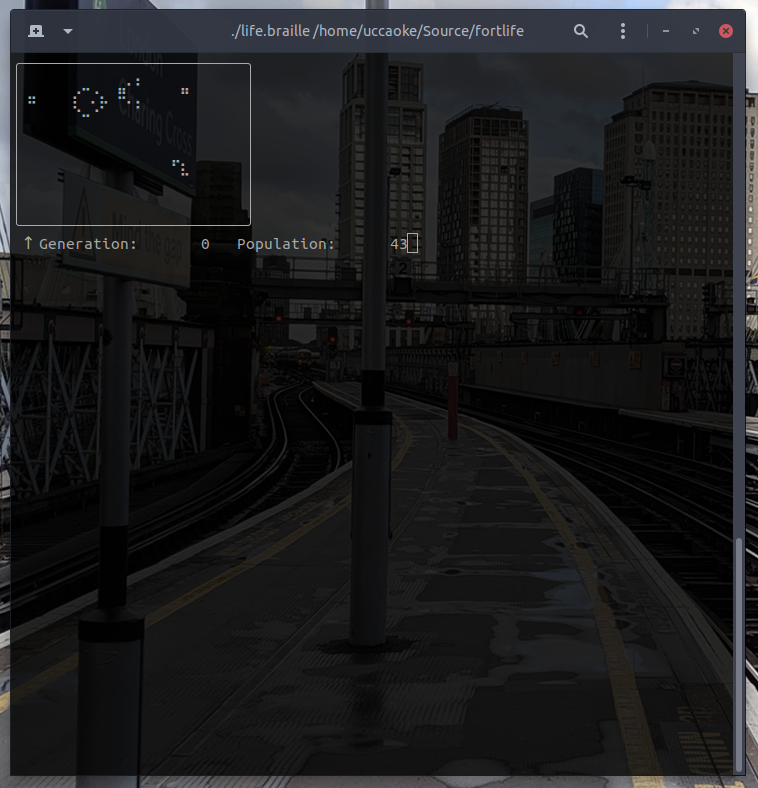

# Conway's Game of Life in Fortran for FreeDOS

This is a fairly simple implementation of Conway's Game of Life, written in Fortran 77 for the Open Watcom compiler on FreeDOS, but which also compiles on GFortran on Linux.

## Compilation

On FreeDOS, install the Open Watcom Fortran compiler, download the repository and then compile the code by running `wmake`.  Optionally, you can also compile a tool for displaying PBM files by running `wmake show.exe`.

On Linux, you can compile the code with gfortran by running `make -f Makefile.gnu`.  You can also build the show utility, but you are better of using basically any other image viewer.

(Testing has shown that the Linux version of `life.exe` compiles successfully under Cygwin, the only downside being font support in MinTTY).

There is a special Linux version if your font has braille characters, which can be run by running `life.braille`.

On Linux, the program clears the screen between iterations using ANSI control codes.  This is yet to be implemented on the DOS version.

## Running

To run the code, run `life.exe <inputfile>` for some input PBM file.  Some examples can be found in the `input` directory.

The program will draw the file into the terminal, move forward a generation with each press of the `Enter` key. Press `ctrl-c`, `Enter` to quit (the last `Enter` is not necessary on Linux).

Here is the output when run on Linux (note, you need a Unicode supporting terminal):

Here is the output of the braille version:

